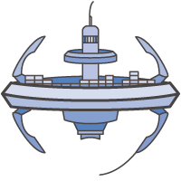

# Awesome ECS

A curated list of guides, development tools, and resources for [Amazon EC2 Container Service](https://aws.amazon.com/ecs/) (ECS). This list includes both community created content as well as content created by AWS.

_Want to add something? Open a PR!_ 🙂

* __Getting Started__
  - [The Hitchhikers Guide to AWS ECS and Docker](http://start.jcolemorrison.com/the-hitchhikers-guide-to-aws-ecs-and-docker/) by [J. Cole Morrison](https://twitter.com/JColeMorrison) - Introduction to AWS ECS concepts
  - [Working with AWS ECS](https://blog.rackspace.com/working-aws-ecs) by [Sriram Rajan](https://twitter.com/sriramrajan) of Rackspace
  - [Up and running using only the command line](https://mdln.net/articles/ecs-walkthrough.html) - Great guide by [Madeleine Thompson](https://github.com/madeleineth), perfect for the CLI lovers among us

* __Automation and Infrastructure__
  - [CloudFormation ECS](https://github.com/awslabs/ecs-refarch-cloudformation) - Reference architecture for deploying microservices to ECS in tiered VPC with NAT gateways and two availability zones.
  - [Terraform ECS](https://github.com/arminc/terraform-ecs) by [Armin Coralic](https://twitter.com/acoralic) - Production ready AWS ECS infrastructure as code with Terraform
  - [CloudFormation Templates by Cloudonaut](https://cloudonaut.io/new-cloudformation-templates-ecs-cluster-service-legacy-vpc-wrapper-automated-tests/)
  - [mu](https://github.com/stelligent/mu) - This devops tool helps you setup ECS as a platform to deploy microservices on

* __Build and Deploy Tools__
  - [ECS CLI](https://github.com/aws/amazon-ecs-cli) - Docker Compose compatible deployment tool by AWS
  - [Empire](https://github.com/remind101/empire/blob/master/README.md) - Control layer on top of ECS that provides a Heroku like workflow
  - [Broadside](https://github.com/lumoslabs/broadside/) - Ruby based command line tool for deploying to ECS
  - [UFO](https://github.com/tongueroo/ufo/blob/master/README.md) - Ruby based tool for building containers and shipping them to ECS
  - [Simple bash deployment script](https://spin.atomicobject.com/2017/06/06/ecs-deployment-script/) by [Justin Kulesza](https://twitter.com/JustinKulesza)
  - [Pnzr](https://github.com/jobtalk/pnzr) - Go based tool for building and pushing to ECS, also has integraton with AWS KMS for secrets management.
  - [Deplojo](https://github.com/LabD/ecs-deplojo) - Python based deployment tool using ECS
  - [Convox](https://convox.com/) - Easily build, deploy and scale applications on ECS
  - [ecsctl](https://github.com/cxmcc/ecsctl) - Open source tool similar to Kubernetes `kubectl` for ECS.

* __Implementation Guides__
  * __Autoscaling__
    - [Simple autoscaling guide](https://www.codementor.io/jholub/amazon-ecs-auto-scale-docker-containers-6keydo24n)
    - [Autoscaling based on multiple metrics](http://garbe.io/blog/2017/04/12/a-better-solution-to-ecs-autoscaling/)
  * __Networking__
    - [Private subnets tutorial](https://www.topcoder.com/blog/aws-container-services-private-subnets-tutorial/)
  * __Service Discovery__
    - [Using DNS](https://github.com/awslabs/ecs-refarch-service-discovery/)
    - [Using Consul](https://aws.amazon.com/blogs/compute/service-discovery-via-consul-with-amazon-ecs/)
    - [Using Weaveworks](https://www.weave.works/blog/using-weave-to-network-containerized-microservices-on-amazon-ecs/)
    - [Using linkerd](https://medium.com/attest-engineering/linkerd-a-service-mesh-for-aws-ecs-937f201f847a)
  * __Secrets Management__
    - [Using Parameter Store and IAM Roles for Tasks](https://aws.amazon.com/blogs/compute/managing-secrets-for-amazon-ecs-applications-using-parameter-store-and-iam-roles-for-tasks/)
    - [Using ECS Task roles for managing AWS credentials](https://medium.com/@RemindEng/keeping-aws-secrets-secret-with-ecs-ec4a51517b4d)
  * __Docker for .NET Developers__
    - [Part One: Intro](https://www.stevejgordon.co.uk/docker-dotnet-developers-part-1)
    - [Part Two: Our First dockerfile](https://www.stevejgordon.co.uk/docker-for-dotnet-developers-part-2)

* __Other Tools__
  - [Blox](https://blox.github.io/) - Framework for advanced cluster management and scheduling
  - [Watchbot](https://github.com/mapbox/ecs-watchbot) - This tool by [Mapbox](https://www.mapbox.com/) helps you run data processing across an ECS cluster in response to external events

* __Reference Architectures__
  - [Microservice cloudformation stack](https://github.com/awslabs/ecs-refarch-cloudformation)
  - [Node.js Microservices](https://github.com/awslabs/amazon-ecs-nodejs-microservices)
  - [Java Microservices on AWS ECS](https://github.com/awslabs/amazon-ecs-java-microservices)
  - [Swift ECS Workshop](https://github.com/awslabs/swift-ecs-workshop)
  - [NGINX Reverse Proxy sidecar container on AWS ECS](https://github.com/awslabs/ecs-nginx-reverse-proxy)
  - [Deploying a Deep Learning Framework on ECS](https://github.com/awslabs/ecs-deep-learning-workshop)
  - [Powering your Amazon ECS Cluster with Amazon EC2 Spot Instances](https://github.com/awslabs/ec2-spot-labs/tree/master/ecs-ec2-spot-fleet)

* __Build Pipeline__
  - [Continuous Deployment Reference Architecture](https://github.com/awslabs/ecs-refarch-continuous-deployment)
  - [Continuous Deployment of a Dockerized Node.js Application to AWS ECS](https://semaphoreci.com/community/tutorials/continuous-deployment-of-a-dockerized-node-js-application-to-aws-ecs)
  - [Easy Blue-Green Deployments on Amazon EC2 Container Service](https://blog.codeship.com/easy-blue-green-deployments-on-amazon-ec2-container-service/)
  - [How to configure a Gitlab -> ECS continuous deployment pipeline](http://jeanphix.me/2017/06/14/how-to-configure-a-gitlab-ecs-continuous-deployment-pipeline/)
  - [Isolated Regression Testing](https://aws.amazon.com/blogs/compute/amazon-ecs-at-the-climate-corporation-using-ecr-and-multiple-accounts-for-isolated-regression-testing/)
  - [Continuously Deploy to AWS ECS using Shippable](http://blog.shippable.com/continuous-delivery-from-github-to-amazon-ecs)
  - [Build and Deploy Go webapp on AWS ECS via CircleCI](https://github.com/circleci/go-ecs-ecr)
  - [Containerized Atlassian Bamboo Builds on ECS](https://bitbucket.org/atlassian/per-build-container)
  - [Automate Zero Downtime Deployment with Amazon ECS and Lambda](https://medium.com/@YadavPrakshi/automate-zero-downtime-deployment-with-amazon-ecs-and-lambda-c4e49953273d)

* __Presentations__
  - [Running your Dockerized application(s) on AWS EC2 Container Service](https://speakerdeck.com/mpas/running-your-dockerized-application-s-on-aws-ec2-container-service) by [Marco Pas](https://twitter.com/marcopas)
  - [Microservices on AWS with Weaveworks](https://www.youtube.com/watch?v=nSvpjZkmYIM)
  - [Running a Virtual World via ECS](https://www.youtube.com/watch?v=wGg_4aFOHsY) - Linden Labs on their usage of ECS
  - [Advanced Task Scheduling with AWS ECS](https://www.youtube.com/watch?v=RJZU0zZoKR8)
  - [Instacart on running microservices on Amazon ECS](https://www.youtube.com/watch?v=CtALTTjy7Qw)
  - [Building Next-Generation Applications with Amazon ECS](https://www.youtube.com/watch?v=xIc3WT6kAVw) - How Meteor Built Galaxy on Amazon ECS
  - [Amazon ECS at Coursera: A General Purpose Microservice](https://www.slideshare.net/AmazonWebServices/cmp406-amazon-ecs-at-coursera-a-generalpurpose-microservice)

* __Company Tech Blog Stories__

   - [Airtime](https://airtime.com) - [Microservice Continuous Integration Made Easy with AWS ECS](https://techblog.airtime.com/microservice-continuous-integration-made-easy-with-aws-ecs-10d470e31af0)
   - [Segment](https://segment.com) - [Rebuilding Our Infrastructure with Docker, ECS, and Terraform](https://segment.com/blog/rebuilding-our-infrastructure/)
   - [Nextdoor](https://nextdoor.com) - [How Nextdoor made a 10x improvement in release times with Docker and Amazon ECS](https://engblog.nextdoor.com/how-nextdoor-made-a-10x-improvement-in-release-times-with-docker-and-amazon-ecs-35aab52b726f)
   - [MapBox](https://mapbox.com) - [We switched to Amazon ECS and you won't believe what happened next](https://blog.mapbox.com/we-switched-to-amazon-ecs-and-you-wont-believe-what-happened-next-6cadbbf7282c)
   - [Wrapp - On how EC2 Container service simplified our infrastructure stack](https://medium.com/wrapp-tech/on-microservices-and-ecs-wrapp-90665d6c0339)
